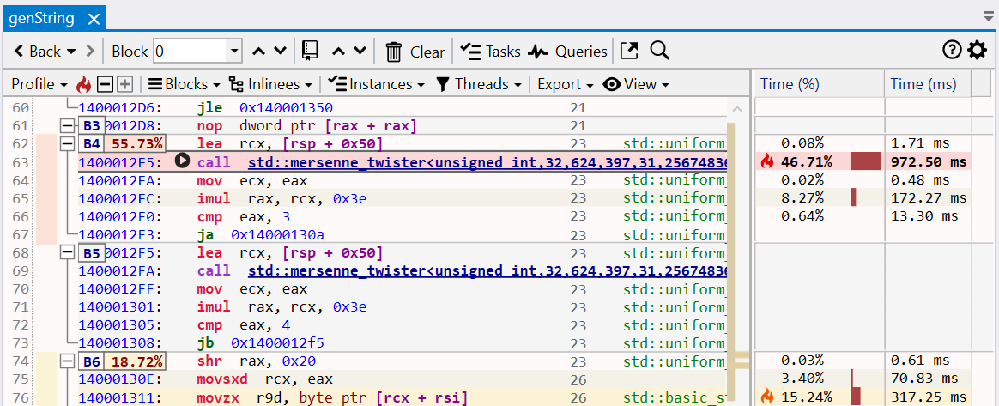
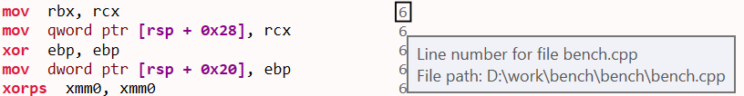
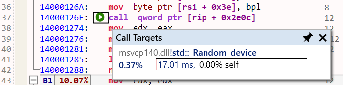
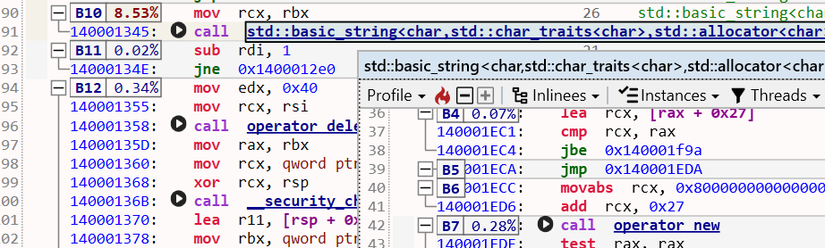
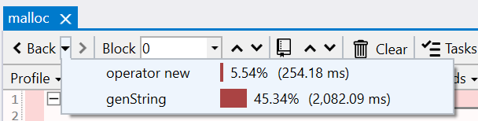
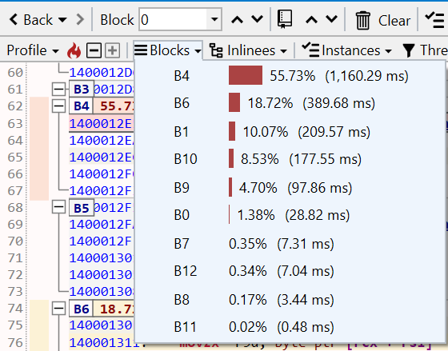

#### Overview

The Assembly view shows the function's machine code after disassembly, with syntax highlighting for x86_64/ARM64 architectures. The view is interactive, with the text being parsed into instructions with operands and higher-level constructs such as [basic blocks](https://en.wikipedia.org/wiki/Basic_block) and loops are recovered.

The assembly instructions are augmented with annotations from the debug information files, such as source line numbers and inlinees, and combined with the execution time from the profile trace.

{:target="_blank"}

The view has four parts:  

- a main toolbar at the top, with general action buttons.
- a secondary toolbar underneath with profiling-specific info and action buttons.
- the text view with the function's assembly
- several columns on the right side with the profiling data. If CPU performance counters are found and loaded from the trace, the additional columns with metrics and the counters are appended after the last column.  

???+ note
    When a function is opened in the Assembly view, its corresponding source file is automatically loaded in the *Source File* view and its [control-flow graph (CFG)](https://en.wikipedia.org/wiki/Control-flow_graph) displayed in the *Flow Graph* view. 
    {:target="_blank"}

#### Assembly text view

The function assembly area can be treated a read-only code editor. Each line corresponds to one instruction, with the following values from left to right:

- instruction number (line number in the text)
- instruction virtual address (blue text)
- instruction opcode (bold text)
- an optional list of instruction operands
- source line number associated with the instruction, obtained from the debug info (gray text).
- inlinees (inlined functions) associated with the instructio, obtained from the debug info (green text).

##### Source lines

The debug information files usually contain a mapping between the source line numbers and the instructions that were generated for those lines. If available, the source line number is appended at the end of an instruction. Note that accuracy of this mapping usually depends on the compiler optimization level, with higher levels being less accurate or even lacking the mapping for some instructions.

Hovering over the line number shows a tooltip with the name and path of the source file. To copy this info to clipboard, first *click* the line number, then press *Ctrl+C*.  

[{: style="width:500px"}](img/assemlby-line-number_816x106.png){:target="_blank"}  

???+ note
    *Click* on an instruction selects and brings into view its corresponding source line in the *Source File* view and its basic block in the *Flow Graph* view.  

    When multiple instructions are selected, the application status bar displays the sum of their execution time as a percentage and value.  
    {:target="_blank"}
    
##### Inlinees

During function inlining, the compiler may preserve additional details about the functions code being inlined so that the origin of an instruction can be saved into the debug information file. If available, the inlinees (inlined functions) are appended after the source line number, separated by the | letter.

For example, if the function contains a call chain like *foo() -> bar()*, with both calls being inlined, the final instructions will record the fact that they originate from *bar*, which got inlined into *foo*, then *foo* inlined into the function.

Hovering over the inlinee shows a tooltip with the call path (stack trace) of the functions inlined at that point. To copy this info to clipboard, first *click* the inlinee, then press *Ctrl+C*:  

[{: style="width:500px"}](img/assembly-inlinees_926x222.png){:target="_blank"}

##### Basic blocks

The assembly is parsed and analyzed to recover the function's [control-flow graph (CFG)](https://en.wikipedia.org/wiki/Control-flow_graph), identifying [basic blocks](https://en.wikipedia.org/wiki/Basic_block) and loops. This information is used to split the assembly text into basic blocks and to display the Flow Graph view.

The example below shows a subset of a function's basic blocks, with the corresponding control-flow graph part from the *Flow Graph* view. The basic blocks B3-B6 are marked on the left side as folding sections that can be collapsed/expanded with a *click* on the -/+ buttons.

Notice how B5 is recognized for being a loop (the last instruction in the block jumps to the start of the block). The Flow Graph view uses a green arrow to mark loops - B4 is also the start block of a larger loop.

[{: style="width:500px"}](img/assembly-flow-graph_579x600.png){:target="_blank"}  

???+ note
    *Click* on the target address of a jump/branch instructions marks the target instruction and its basic block in the *Flow Graph* view (uses a green background color by default).  

    *Double-click* on a target address operand jumps to the target instruction.

##### Profiling annotations

Instruction execution time is displayed and annotated on several parts of the assembly instructions, columns, basic blocks and the control-flow graph, using text, colors and flame icons:

{:target="_blank"}  

- the *Time (%)* column displays the instruction's execution time percentage relative to the total function execution time. The column style can be changed in the Assembly options.
- the *Time (ms)* column displays the instruction's execution time value. The time unit and column style can be changed in the Assembly options.
- the instruction background is colored based on its execution time - the slowest instruction has a red color, next slowest orange, then shades of yellow. The instruction location is also marked in the vertical text scrollbar.
- the three slowest instructions also have a flame icon in the *Time (%)* column using the same color coding.

{:target="_blank"}  

- the basic blocks have a label with the block's execution time percentage, as a sum of its instruction's execution time (in the example above, the 55.73% label for B4). Hovering over the label shows the block's execution time value. The label background color uses the same color coding.
- the basic blocks in the *Flow Graph* view have below the same execution time percentage label as in the Assembly view, with the corresponding background color.

???+ note
    When displaying a function for the first time, by default, the slowest instruction is selected and brought into view (this can be configured in the Assembly options). 
    When the function is displayed subsequently, the last vertical scroll position is used instead.

    To jump at any time to the slowest instruction, *click* the red *Flame* icon from the toolbar or the *Ctrl+H* keyboard shortcut.

##### Call targets

Combining the parsed assembly and profiling information, call instructions are marked with their target(s) and have an arrow icon placed before the call opcode:  

- for direct calls (target is an function name/address), a black arrow is used.
- for indirect or virtual function calls (target is a register or memory operand), a green arrow is used.

Hovering with the mouse over the arrow displays a list of the target functions, with details about the execution time. For example, the indirect call below at runtime has the *std::_Random_device* function as a sole target:

[{: style="width:500px"}](img/assembly-call-target_691x172.png){:target="_blank"} 

???+ note
    Functions in the list have a right-click context menu with options to open the Assembly view, preview popup, and select the function in the other views. Double-click/Ctrl+Return opens the Assembly view for the selected function. Combine these shortcuts with the Shift key to open the Assembly view in a new tab instead.

 Direct call instructions with a known target change the function name operand into a link (underlined, bold, blue text). The link makes it easy to navigate to navigate to the called function and the history to go back.

- *Double-click* on the function name (or the Return key with the name selected) opens the called function in the same tab.  
- *Shift+Double-Click* (or Shift+Return) opens the called function in a new tab.  
- *Alt+Return* shows a preview popup with the called function's assembly.  
- *Hovering* with the mouse over the function name also shows the preview popup.

{:target="_blank"}  

##### Opened functions history

When multiple functions are opened in the same tab, a history is kept per tab that makes it possible to go back/forward to a previous/next opened function. This is especially useful when navigating to a called function by double-clicking its name in the assembly, since it makes it easy to back to the caller.  

*Click* the *Back* button in the toolbar to navigate back to the previous function in the sequence (or press the *Backspace* key or the optional *Back* button on the mouse). The back button also has a menu that lists the previous functions.  

*Click* the > button in the toolbar to navigate to the next function in the sequence (or press the optional *Forward* button on the mouse). 

[{: style="width:450px"}](img/assembly-back-menu_608x154.png){:target="_blank"}  

#### Profiling toolbar

The profiling toolbar provides more advanced functionality for identifying the slow parts of a function and filtering the profiling data based on a function instance and the threads the function executed on.

##### Profile

[{: style="width:550px"}](img/assembly-profile_782x436.png){:target="_blank"}  

##### Blocks

[{: style="width:400px"}](img/assembly-blocks_560x439.png){:target="_blank"}  

##### Inlinees

{:target="_blank"}  

##### Instances

{:target="_blank"}  

##### Threads

#### Exporting

The function's assembly, combined with source line numbers and profiling annotations and execution time can be exported and saved into multiple formats, with the slowest instructions marked using a similar style as in the application:

- Excel worksheet (*.xlsx)  
  [{: style="width:450px"}](img/assembly-export-excel_780x441.png){:target="_blank"}
- HTML table (*.html)  
  [{: style="width:450px"}](img/summary-export-html_1209x287.png){:target="_blank"}
- Markdown table (*.md)  
  {:target="_blank"}

#### Assembly view interaction

???+ abstract "Toolbar"
    | Button | Description |
    | ------ | ------------|
    |  | If enabled, selecting a function also selects it in the other profiling views. |
    |  | If enabled, selecting a function also displays the source in the Source file view, with the source lines annotated with profiling data. |
    | Export | Export the current function list into one of multiple formats (Excel, HTML and Markdown) or copy to clipboard the function list as  a HTML/Markdown table. |
    | Search box | Search for functions with a specific name using a case-insensitive substring search. Searching filters the list down to display only the matching entries. Press the *Escape* key to reset the search or the *X* button next to the input box. |

???+ abstract "Mouse shortcuts"
    | Action | Description |
    | ------ | ------------|
    | Hover | Hovering over a function displays a popup with the stack trace (call path) end with the slowest function's instance. Pin or drag the popup to keep it open. |
    | Click | Selects the function in the other views if *Sync* is enabled in the toolbar and displays the source in the Source file view if *Source* is enabled in the toolbar.  |
    | Double-click | Opens the Assembly view of the selected function in the current tab. |
    | Shift+Double-click | Opens the Assembly view of the selected function in a new tab. |
    | Right-click | Shows the context menu for the selected functions. |

    !!! note ""
        When multiple functions are selected, the application status bar displays the sum of their execution time as a percentage and value.

???+ abstract "Keyboard shortcuts"
    | Keys | Description |
    | ------ | ------------|
    | Return | Opens the Assembly view of the selected function in the current tab. |
    | Shift+Return | Opens the Assembly view of the selected function in a new tab. |
    | Ctrl+Shift+Left | Opens the Assembly view of the selected function in a new tab docked to the left of the active tab. |
    | Ctrl+Shift+Right | Opens the Assembly view of the selected function in a new tab docked to the right of the active tab. |
    | Alt+Return | Opens a preview popup with the assembly of the selected function. Press the *Escape* key to close the popup.  Multiple preview popups can be can be kept open at the same time. |
    | Ctrl+C | Copies to clipboard a HTML and Markdown table with a summary of the selected functions. |
    | Ctrl+Shift+C | Copies to clipboard the function names of the selected functions. |
    | Ctrl+Alt+C | Copies to clipboard the mangled/decorated function names of the selected functions. |

- tooltip over tab name

- toolbar
- mouse, keyboard shortcuts
- profiling toolbar
  - jump to hottest
  - elements
  - blocks
  - inlinees
  - instances
  - threads

TODO later:
- options panel