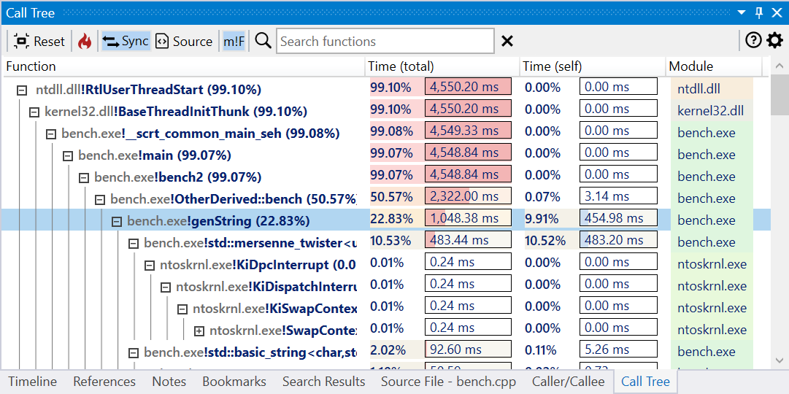

{:target="_blank"}

The Call Tree view displays the tree derived from combining the call stacks associated with all profile samples in the trace, with each node representing a unique instance of a function. The node total execution time is computed by accumulating the time of all samples that have the instance in the call stack. The node's children represents the callees (called functions) and the parent the caller function.  

By default, the call path with the longest execution time is expanded in the view.

- expand hottest path
- right-click context menu
- mouse, keyboard shortcuts
- hover shows preview like in flame graph (details panel)