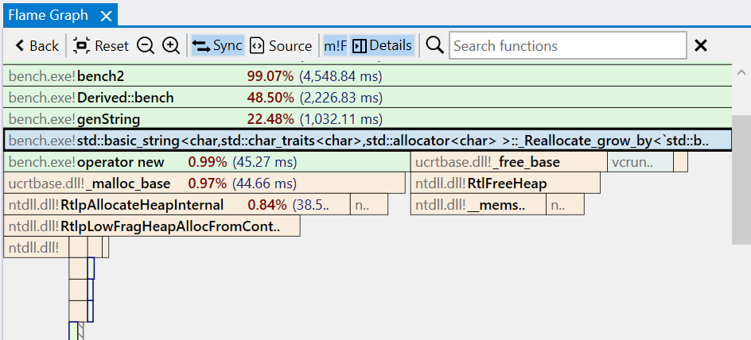
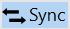

???+ note "Introduction to flame graphs"
    A flame graph is an alternative, more compact way of viewing a call tree. In this view, function instances are nodes with a size proportional to the time spent relative to the parent (caller) function and makes it easier to identify the portions of the app that take most of the time.  

    Nodes are sorted in the horizontal direction based on decreasing time relative to their parent node, while the ordering in the vertical direction forms a stack trace (a path in the call tree).
   
    {: style="width:320px"}  
    In the example above, the *main* function is considered the prcoess entry point, calling *foo* and *bar*, with *foo* taking 60% of the time and *bar* 40%. Function *foo* spends a part of its total (inclusive) time in the calls to *baz* and *etc1*, while the rest is self (exclusive) time, meaning instructions part of *foo* which are not calls to other functions.  

    Note that there are two instances of the function *baz* with different execution time, each with a unique path to it in the call tree starting from *main* (all other functions have a single instance). You can see the time of each instance by hovering with the mouse over it or in the *Details panel* after it's selected.

    The following links provide an introduction to the flame graph visualization concept, its history, and how it's being used across the industry for performance investigations.  

    - [CPU Flame Graphs (brendangregg.com)](https://www.brendangregg.com/FlameGraphs/cpuflamegraphs.html)
    - [Visualizing Performance - The Developers’ Guide to Flame Graphs (youtube.com)](https://www.youtube.com/watch?v=VMpTU15rIZY)

#### Flame graph interaction

The Flame graph view is the main means of identifying the parts of the application where most time is spent. The view has three main parts:

- a toolbar at the top, with action buttons and the *Search* input box.
- the interactive flame graph itself.
- the optional Details panel on the right side. The panel displays detailed info about the selected node(s), and its visibility can be toggled using the *Details* button in the toolbar

{:target="_blank"}

##### Flame graph nodes

The flame graph displays nodes representing functions stacked top to bottom according to the call tree paths forming the stack traces. Each node is a unique instance of a function — a function having multiple instances means there are several paths in the call tree that call the function.  

Each node has the function name, optionally prepended with the module name, followed by the execution time percentage relative to the entire trace and the execution time.  

By default, the nodes are color-coded based on the module names to which the functions belong. Nodes for functions executing in the kernel/managed context are marked with a different text and border color (blue by default). The displayed text fields and colors can be customized in the Flame graph options.  

!!! note ""
    Note that when the called function nodes are too small to be visible in the view, they are collapsed under a placeholder node rendered with a hatch pattern. Placeholder nodes are expanded into individual nodes when zooming in the view.  

##### Navigating the Flame graph

A double-click on a node enlarges it to cover the entire view and may expand the collapsed nodes. For example, the called nodes become visible after double-clicking the node hovered in the screenshot above.  
{:target="_blank"}

The node enlarging can be repeated to go deeper down the call path. The *Back* button in the toolbar (or *Backspace* key/*Back* mouse button) undoes the operation and returns the view to its previous state.  

{:target="_blank"}

!!! note ""
    Notice how in the screenshot above the nodes starting with *ntoskrnl.exe!KiPageFault* use a different style to mark code executiong in kernel mode. The user mode and kernel mode call stacks are automatically combined.

##### Changing the root node

It can be useful to view only a subregion of the Flame graph. By changing the root node, only nodes for functions starting with the new root are displayed and execution time percentages are computed relative to the new root starting at 100%.

To change the root node, from the right-click context menu, select *Set Function as Root* (alternatively, use the Alt+Double-click shortcut). After the switch, the toolbar displays the name of the current root node. Setting a new root node can be repeated in the new view.

To remove the root node and view the entire Flame graph, click the *X* button next to its name in the toolbar. If multiple nested root nodes were set, removing the current node activates the previous one.

{:target="_blank"}

#### Toolbar buttons

| Button | Description |
| ------ | ------------|
|  | Undoes the previous action, such as enlarging a node or changing the root node. |
|  | Resets the view to it's original state, displaying the entire Flame graph. |
|  | Zooms out the view around the center point. |
|  | Zooms in the view around the center point. |
|  | If enabled, selecting a node also selects the associated function in the other profiling views. |
|  | If enabled, selecting a node also displays the associated function in the Source file view, with the source lines annotated with profiling data. |
|  | If enabled, display the module name before the function name in the nodes as module!function. |
|  | If enabled, display the Details panel on the right side of the Flame graph view. |
| Search box | Search for nodes with a specific function name using a case-insensitive substring search. Press the *Escape* key to reset the search or the *X* button next to the input box. |

#### Mouse shortcuts

| Action | Description |
| ------ | ------------|
| Hover | Hovering over a node briefly displays a preview popup with the complete function name and total/self execution times. Clicking the *Pin button* or dragging the popup expands it into a panel equivalent to the *Details panel*. Multiple such panels can be kept open at the same time. |
| Click | Selects the pointed node and deselects any previously selected nodes. The *Details panel* is updated and, if *Sync* is enabled, the function is selected in the other panels.  Clicking an empty part of the view deselects all nodes. |
| Ctrl+Click | Selects the pointed node and keeps the previously selected nodes (append). The *Details panel* is updated to display a combined view of all selected nodes. |
| Shift+Click | When a node is selected, it expands the selection to include all nodes in the call stack between the pointed node and the selected one. The *Details panel* is updated to display a combined view of all selected nodes. |
| Double-click | Enlarges (zooms-in) the pointed node to cover the view's width, adjusting child node widths accordingly. |
| Ctrl+Double-click | Opens the Assembly view of the selected function in the current tab. |
| Ctrl+Shift+Double-click | Opens the Assembly view of the selected function in a new tab. |
| Alt+Double-click | Sets the selected node as the root node of the Flame graph. |
| Back | If the mouse has an optional *Back* button, this undoes the previous action, such as enlarging a node (double-click) or changing the root node. An alternative is pressing the *Backspace* key or the *Back* button in the toolbar.|
| Right-click | Shows the context menu for the selected nodes. |
| Click+Drag | If the flame graph is larger than the view, clicking on and dragging an empty part of the view moves the view in the direction of the mouse. |
| Scroll wheel | Scrolls the view vertically if the flame graph is larger than the view |
| Shift+Scroll wheel | Scrolls the view horizontally if the flame graph is larger than the view |
| Ctrl+Scroll wheel | Zooms in or out the view around the mouse pointer position. |
| Click+Scroll wheel | Zooms in or out the view around the mouse pointer position. |

#### Keyboard shortcuts

| Keys | Description |
| ------ | ------------|
| Return | Enlarges (zooms-in) the pointed node to cover the view's width, adjusting child node widths accoringly. |
| Ctrl+Return | Opens the Assembly view of the selected function in the current tab. |
| Ctrl+Shift+Return | Opens the Assembly view of the selected function in a new tab. |
| Alt+Return | Opens a preview popup with the assembly of the selected function. Press the *Escape* key to close the popup.  Multiple preview popups can be can be kept open at the same time. |
| Alt+Shift+Return | Opens a preview popup with the assembly of the selected function, with profile data filtered to include only the selected instance. |
| Ctrl+C | Copies to clipboard a HTML and Markdown table with a summary of the selected nodes. |
| Ctrl+Shift+C | Copies to clipboard the function names of the selected nodes. |
| Ctrl+Alt+C | Copies to clipboard the mangled/decorated function names of the selected nodes. |
| Backspace | Undoes the previous action, such as enlarging a node (double-click) or changing the root node. |
| Ctrl+= | Zooms in the view around the center point. |
| Ctrl+- | Zooms out the view around the center point. |
| Ctrl+0  Ctrl+R | Resets the view to the initial state. |
| Arrow keys | Scrolls the view in the horizontal and vertical directions if the flame graph is larger than the view. |

#### Marking nodes

#### Details panel

#### Searching

#### Options

##### General
##### Appearance
##### Details panel