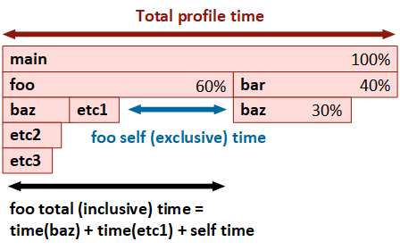

???+ note "Introduction to flame graphs"
    A flame graph is an alternative, more compact way of viewing a call tree. In this view, function instances are nodes with a size proportional to the time spent relative to the parent (caller) function and makes it easier to identify the portions of the app that take most of the time.  

    Nodes are sorted in the horizontal direction based on decreasing time relative to their parent node, while the ordering in the vertical direction forms a stack trace (a path in the call tree).
   
      
    In the example above, the *main* function is considered the prcoess entry point, calling *foo* and *bar*, with *foo* taking 60% of the time and *bar* 40%. Function *foo* spends a part of its total (inclusive) time in the calls to *baz* and *etc1*, while the rest is self (exclusive) time, meaning instructions part of *foo* which are not calls to other functions.  

    Note that there are two instances of the function *baz* with different execution time, each with a unique path to it in the call tree starting from *main* (all other functions have a single instance). You can see the time of each instance by hovering with the mouse over it or in the *Details panel* after it's selected.

    The following links provide an introduction to the flame graph visualization concept, its history, and how it's being used across the industry for performance investigations.  

    - [CPU Flame Graphs (brendangregg.com)](https://www.brendangregg.com/FlameGraphs/cpuflamegraphs.html)
    - [Visualizing Performance - The Developers’ Guide to Flame Graphs (youtube.com)](https://www.youtube.com/watch?v=VMpTU15rIZY)

The Flame graph view is the main means of identifying the parts of the application where most time is spent. The view has three main parts:

- a toolbar at the top, with action buttons and the *Search* input.
- the interactive flame graph itself
- the optional Details panel on the right side. The panel displays detailed info about the selected node(s) and its visiblilty can be toggled using the *Details* button in the toolbar.

{:target="_blank"}

### Flame graph interaction

- Define what a node is (function instance)
- nodes too small to render replaced by placeholder (pattern)
  - zoom in to view using Ctrl+scroll whell
- color coding by module
  - user/kernel/managed code distinction

#### Mouse shortcuts

| Shortcut | Description |
| ------ | ------------|
| Hover | Hovering over a node for a short time displays a preview popup showing the complete function name and total/self execution times. Clicking the *Pin button* or dragging the popup expands it into a panel equivalent to the *Details panel*. Multiple such panels can be kept open at the same time. |
| Click | Selects the pointed node and deselects any previously selected node. The *Details panel* is updated and, if *Sync* is enabled, the function is selected in the other panels.  Clicking an empty part of the view deselects all nodes. |
| Ctrl+Click | Selects the pointed node and keeps the previously selected nodes (append). The *Details panel* is updated to display a combined view of all selected nodes. |
| Shift+Click | When a node is already selected, it expands the selection to include all nodes in the call stack found between the pointed node and selected one. The *Details panel* is updated to display a combined view of all selected nodes. |
| Double-click | Enlarges (zooms-in) the pointed node to cover the view's width, adjusting child node widths accoringly. |
| Back | If the mouse has an optional *Back* button, this undoes the previous action, such as enlarging a node (double-click) or changing the root node. An alternative is pressing the *Backspace* key or the *Back* button in the toolbar.|
| Right-click | Shows the context menu for the selected nodes. Available actions are documented below. |
| Click+Drag | Clicking on aan empty part of the view and dragging moves the view in the direction of the mouse if the flame graph is larger than the view. |
| Scroll wheel | Scrolls the view vertically, if the flame graph is larger than the view |
| Shift+Scroll wheel | Scrolls the view horizontally, if the flame graph is larger than the view |
| Ctrl+Scroll wheel | Zooms in or out the view around the mouse pointer position. |
| Click+Scroll wheel | Zooms in or out the view around the mouse pointer position. |

#### Keyboard shortcuts

| Shortcuts | Description |
| ------ | ------------|

### Toolbar buttons

### Context menu

#### Exporting
HTML or markdown

#### Marking

TODO:
- focus on node (double click)
- change root node
- sync selected function + source file
- back button (mention mouse back button)
- search
- context menu (open, instances, marking, copy node details)
- details panel summary (with link to Additional functionality page)

### Details panel

### Searching