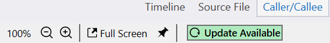

#### Overview

Profile Explorer is a tool for viewing CPU profiling traces collected through the [Event Tracing for Windows (ETW)]((https://learn.microsoft.com/en-us/windows-hardware/drivers/devtest/event-tracing-for-windows--etw-)) infrastructure. Its focus is on presenting the slowest parts of the profiled application through an easy-to-use but detailed UI consisting of several views and panels, such as a hot function list, flame graph, call tree, timeline, assembly code view, and source file view.  

The application offers some unique features based on the binary analysis it performs and the IDE-like UI, such as easy navigation through disassembly, improved mapping to source lines, displaying the function control-flow graph, viewing of multiple functions at the same time, marking, searching, filtering and much more.  

#### Download

Installers for the latest version:  
- [x64 installer](https://github.com/microsoft/profile-explore/releases/latest/download/profile_explorer_installer_x64.exe)  
- [ARM64 installer](https://github.com/microsoft/profile-explore/releases/latest/download/profile_explorer_installer_arm64.exe)

Use the ARM64 installer if you have a machine with an ARM64 CPU, since it includes a native build of the app (no emulation), otherwise use the x64 installer. Note that the x64 app can open traces taken on ARM64 machines and vice versa.  

The installers for previous versions can be downloaded from the [Releases](https://github.com/microsoft/profile-explorer/releases) page.  

#### Automatic updates

The app has a built-in auto-update feature that will notify you when a new version is released and offer to download and install it.

{: style="width:400px"}

#### Documentation tips

Most app views have a *question mark* button in the upper-right corner.  
*Click* it to view the panel's documentation page in the app's built-in *Help* panel.  

Click on an image to enlarge it. Depending on where the documentation is viewed:  

  - the image is opened in a new tab if viewed in a browser.
  - the image is opened in a preview popup if viewed from the app's built-in *Help* panel.  
  To close the preview popup, click again on the image (either in the preview popup or in the page) or press the Escape key.