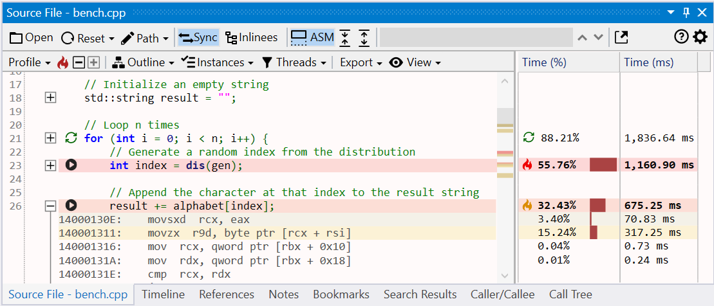
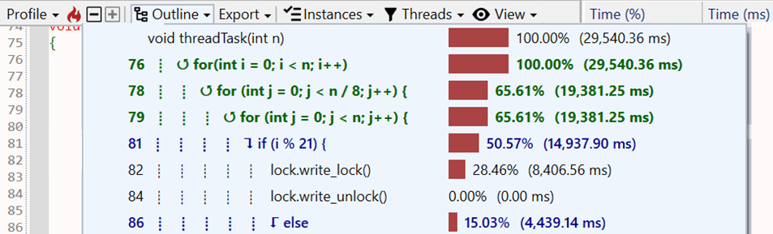

#### Overview

The Source File view displays the source code of the function in the active assembly view. When a function is opened in the Assembly view, using the debug info file, its corresponding source file is identified, downloaded if needed and loaded in the view, with source lines annotated with profiling information.

{:target="_blank"}

##### Finding source files

Locating the source file to load is done with the help of the debug info file, which usually records the file path associated with each function. In some cases, additional information is available that allows locating and downloading source files from remote locations and [Source Servers](https://learn.microsoft.com/en-us/windows/win32/debug/source-server-and-source-indexing).

Steps for locating the source file:  

- check the local file system using the debug info file path. This handles the case of the trace being opened on the same machine where the application was built or the source is available at the same file system location.
- check and download the source file from a [Source Server](https://learn.microsoft.com/en-us/windows/win32/debug/source-server-and-source-indexing) if the debug info file has additional remote mapping information such as  [SourceLink](https://github.com/dotnet/sourcelink) or built-in commands for retrieving the file. In case authentication is needed, it can be configured in the *Load Profile Trace* window [options](trace-loading.md#authentication).
- if neither of the above steps work, ask the user to manually locate the source file on a local file system or network share. The mapping between the expected and actual source file location is saved across sessions when closing the application. See the [Mapping source files](#mapping-source-files) section below for more details.

Once a source file is available, it's signature is computed and compared with the expected signature from the debug info file. If it does not match, it means the source file was modified between the time the application was build and the trace being loaded and it will be rejected (a future version will allow ignoring such a mismatch).

##### Mapping source files

- give mapping example sent in in email to Guillerme

#### Source code view

The view is similar to the Assembly view, having four parts:  

- a main toolbar at the top, with general action buttons.
- a secondary toolbar underneath with profiling-specific info and action buttons.
- the text view with the source file.
- several columns on the right side with the profiling data for each source line. If CPU performance counters are found and loaded from the trace, the additional columns with metrics and the counters are appended after the last column.  

##### Assembly code sections

##### Profiling annotations

##### Call targets

##### Source code outline

{:target="_blank"}

Toolbar buttons:
- Open: open file manually
- Path: options to show file in Explorer, open in editor, copy path
- Reset: reset mapping/restrictions for current file (also in options panel)

Note: call target may have a function that doesn't appear in source line due to inlining

- source file loading
- combined asm toggle, expand sections
- selection, time in status bar
- click on line selects instrs in assembly view

- profiling marking and columns, extra for perf counters
- jump to hottest instr by default

- call target arrow markings
- if/else/loop/switch recognition
  - marking in left doc and columns
  - outline menu

- toolbar
- mouse, keyboard shortcuts
- profiling toolbar
  - jump to hottest
  - lines
  - blocks
  - inlinees
  - instances
  - threads

#### Assembly view interaction

???+ abstract "Toolbar"
    | Button | Description |
    | ------ | ------------|
    |  | If enabled, selecting a function also selects it in the other profiling views. |
    |  | If enabled, selecting a function also displays the source in the Source file view, with the source lines annotated with profiling data. |
    | Export | Export the current function list into one of multiple formats (Excel, HTML and Markdown) or copy to clipboard the function list as  a HTML/Markdown table. |
    | Search box | Search for functions with a specific name using a case-insensitive substring search. Searching filters the list down to display only the matching entries. Press the *Escape* key to reset the search or the *X* button next to the input box. |

#### Exporting

The function's source code, combined with profiling annotations and execution time can be exported and saved into multiple formats, with the slowest source lines marked using a similar style as in the application:

- Excel worksheet (*.xlsx)  
  [{: style="width:450px"}](img/assembly-export-excel_780x441.png){:target="_blank"}
- HTML table (*.html)  
  [{: style="width:450px"}](img/summary-export-html_1209x287.png){:target="_blank"}
- Markdown table (*.md)  
  {:target="_blank"}

The Export menu in the toolbar also has an option to copy to clipboard the function's source code as a HTML/Markdown table (pasting in an application supporting HTML - such as the Microsoft Office suite and online editors - will use the HTML version, code/text editors will use Markdown version instead).  

The Ctrl+C keyboard shortcut copies to clipboard only the selected source lines as a HTML/Markdown table.

#### More documentation in progress
- inlinees
- options panel