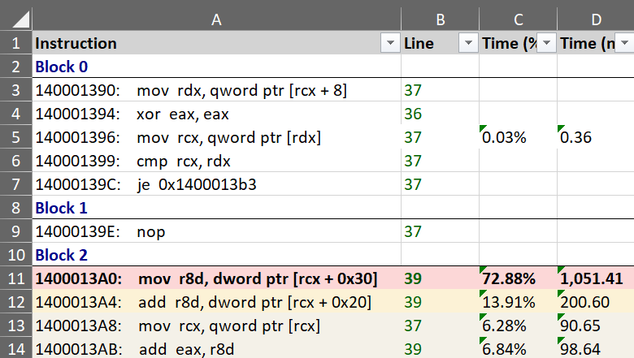
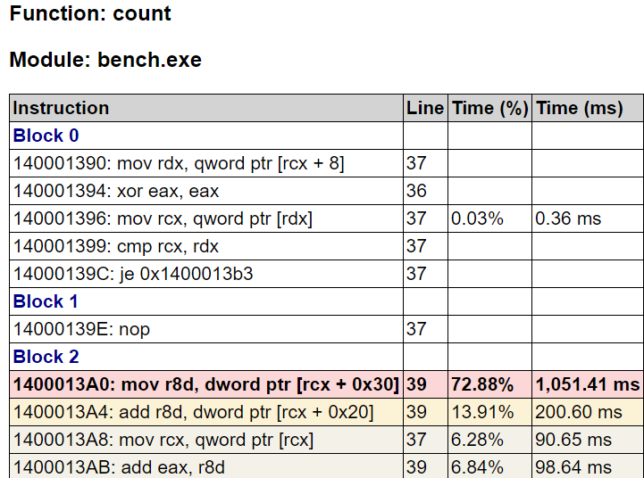
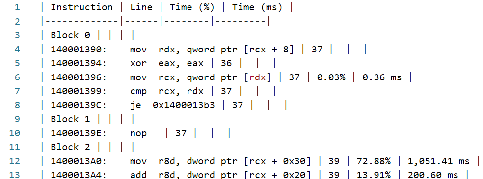

#### Overview

{:target="_blank"}

The Source File view displays the source code of the function in the active assembly view. When a function is opened in the Assembly view, using the debug information file, its corresponding source file is identified, downloaded if needed from a [Source Server](https://learn.microsoft.com/en-us/windows/win32/debug/source-server-and-source-indexing) and the function's source code displayed, with source lines annotated with profiling information.

Note: call target may have a function that doesn't appear in source line due to inlining

Finding file steps:
- check local file system
- check symbol server, try to download using SourceLink (authentication options in profile load window)
- ask user for location, save mapping
- source file signature checked (todo future option to ignore)
- give mapping example sent in in email to Guillerme

Toolbar buttons:
- Open: open file manually
- Path: options to show file in Explorer, open in editor, copy path
- Reset: reset mapping/restrictions for current file (also in options panel)

- source file loading
- combined asm toggle, expand sections
- selection, time in status bar
- click on line selects instrs in assembly view

- profiling marking and columns, extra for perf counters
- jump to hottest instr by default

- call target arrow markings
- if/else/loop/switch recognition
  - marking in left doc and columns
  - outline menu

- toolbar
- mouse, keyboard shortcuts
- profiling toolbar
  - jump to hottest
  - lines
  - blocks
  - inlinees
  - instances
  - threads

#### Assembly view interaction

???+ abstract "Toolbar"
    | Button | Description |
    | ------ | ------------|
    |  | If enabled, selecting a function also selects it in the other profiling views. |
    |  | If enabled, selecting a function also displays the source in the Source file view, with the source lines annotated with profiling data. |
    | Export | Export the current function list into one of multiple formats (Excel, HTML and Markdown) or copy to clipboard the function list as  a HTML/Markdown table. |
    | Search box | Search for functions with a specific name using a case-insensitive substring search. Searching filters the list down to display only the matching entries. Press the *Escape* key to reset the search or the *X* button next to the input box. |

#### Exporting

The function's source code, combined with profiling annotations and execution time can be exported and saved into multiple formats, with the slowest source lines marked using a similar style as in the application:

- Excel worksheet (*.xlsx)  
  [{: style="width:450px"}](img/assembly-export-excel_780x441.png){:target="_blank"}
- HTML table (*.html)  
  [{: style="width:450px"}](img/summary-export-html_1209x287.png){:target="_blank"}
- Markdown table (*.md)  
  {:target="_blank"}

The Export menu in the toolbar also has an option to copy to clipboard the function's source code as a HTML/Markdown table (pasting in an application supporting HTML - such as the Microsoft Office suite and online editors - will use the HTML version, code/text editors will use Markdown version instead).  

The Ctrl+C keyboard shortcut copies to clipboard only the selected source lines as a HTML/Markdown table.

#### More documentation in progress
- inlinees
- options panel