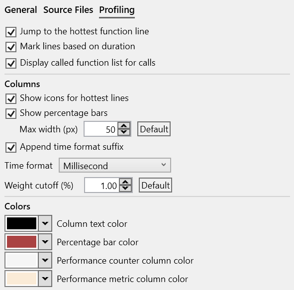

#### Overview

The Source File view displays the source code of the function in the active assembly view. When a function is opened in the Assembly view, using the debug info file, its corresponding source file is identified, downloaded if needed and loaded in the view, with source lines annotated with profiling information.

{:target="_blank"}

##### Finding source files

Locating the source file to load is done with the help of the debug info file, which usually records the file path associated with each function. In some cases, additional information is available that allows locating and downloading source files from remote locations and [Source Servers](https://learn.microsoft.com/en-us/windows/win32/debug/source-server-and-source-indexing).

Steps for locating the source file:  

- check the local file system using the debug info file path. This handles the case of the trace being opened on the same machine where the application was built or the source is available at the same file system location.
- check and download the source file from a [Source Server](https://learn.microsoft.com/en-us/windows/win32/debug/source-server-and-source-indexing) if the debug info file has additional remote mapping information such as  [SourceLink](https://github.com/dotnet/sourcelink) or built-in commands for retrieving the file. In case authentication is needed, it can be configured in the *Load Profile Trace* window [options](trace-loading.md#authentication).
- if neither of the above steps work, ask the user to manually locate the source file on a local file system or network share. The mapping between the expected and actual source file location is saved across sessions when closing the application. See the [Mapping source files](#mapping-source-files) section below for more details.

Once a source file is available, it's signature is computed and compared with the expected signature from the debug info file. If it does not match, it means the source file was modified between the time the application was build and the trace being loaded and it will be rejected (a future version will allow ignoring such a mismatch).

##### Mapping source files

- give mapping example sent in in email to Guillerme

#### Source code view

The view is similar to the Assembly view, having four parts:  

- a main toolbar at the top, with general action buttons.
- a secondary toolbar underneath with profiling-specific info and action buttons.
- the text view with the source file.
- several columns on the right side with the profiling data for each source line. If CPU performance counters are found and loaded from the trace, the additional columns with metrics and the counters are appended after the last column.  

##### Profiling annotations

Similar to the Assembly view, execution time is displayed and annotated on several parts of the source lines and columns using text, colors and flame icons:

- the *Time (%)* column displays the source line's execution time percentage relative to the total function execution time. The column style can be changed in the Source File options.
- the *Time (ms)* column displays the source files's execution time value. The time unit and column style can be changed in the Source File options.
- the source line background is colored based on its execution time - the slowest source line has a red color, next slowest orange, then shades of yellow. The line is also marked in the vertical text scrollbar.
- the three slowest source lines also have a flame icon in the *Time (%)* column using the same color coding.

???+ note
    When loading a source file, by default, the slowest source line is selected and brought into view (this can be configured in the Source File options). 
    
    To jump at any time to the slowest source line, *click* the red *Flame* icon from the toolbar or the *Ctrl+H* keyboard shortcut.

##### Assembly code sections

If enabled, each source line can be followed by a section with the assembly instructions generated for it, based on the debug info file. By default, the sections are collapsed and can be expanded by pressing the + button on the left of the source lines. Each line of assembly has the same kind of profiling annotations as the source lines.

To view the assembly sections, toggle the ASM button in the toolbar (enabled by default). The *Expand* and *Collapse* buttons in the toolbar can be used to toggle the visibility of all assembly sections together.

##### Call targets

Combining the parsed assembly and profiling information, source lines with associated call instructions are marked with their target(s) and have an arrow icon placed before the call opcode:  

- for direct calls (target is an function name/address), a black arrow is used.
- for indirect or virtual function calls (target is a register or memory operand), a green arrow is used.

*Hovering* with the mouse over the arrow displays a target functions list, with details about their execution time. Note that due to function inlining, the list may contain a function that doesn't appear directly in the source code.

TODO: Call target image example

##### Source code outline

On load, source files are parsed using [tree-sitter](https://tree-sitter.github.io/tree-sitter/) in order to build an [Abstract Syntax Tree (AST)](https://en.wikipedia.org/wiki/Abstract_syntax_tree). The AST is used to identify and mark some of the high-level parts of the function's source code, such as if/else/switch statements, for/do/while loops and call expressions. The supported languages are C, C++, C# and Rust.  

For each such statement and expression, the execution time is computed by accumulating the time of each source line found in its range. This makes it easier, for example, to see the amount of time spent in an entire *loop* (or *nested loop*), the *then/else* branch of an *if* statement or a specific *case* of a *switch* statement.  

Example of the outline for a function having three nested loops, with an if/else statement in the last level loop.

{:target="_blank"}

Hovering over a statement marking shows the execution time as a percentage and value relative to the function time and highlights the source lines part of the statement.

{:target="_blank"}

Toolbar buttons:
- Open: open file manually
- Path: options to show file in Explorer, open in editor, copy path
- Reset: reset mapping/restrictions for current file (also in options panel)

- selection, time in status bar
- click on line selects instrs in assembly view

- mouse, keyboard shortcuts
- profiling toolbar
  - jump to hottest
  - lines
  - blocks
  - inlinees
  - instances
  - threads

#### Assembly view interaction

???+ abstract "Toolbar"
    | Button | Description |
    | ------ | ------------|
    |  | If enabled, selecting a function also selects it in the other profiling views. |
    |  | If enabled, selecting a function also displays the source in the Source file view, with the source lines annotated with profiling data. |
    | Export | Export the current function list into one of multiple formats (Excel, HTML and Markdown) or copy to clipboard the function list as  a HTML/Markdown table. |
    | Search box | Search for functions with a specific name using a case-insensitive substring search. Searching filters the list down to display only the matching entries. Press the *Escape* key to reset the search or the *X* button next to the input box. |

#### Exporting

The function's source code, combined with profiling annotations and execution time can be exported and saved into multiple formats, with the slowest source lines marked using a similar style as in the application:

- Excel worksheet (*.xlsx)  
  [{: style="width:450px"}](img/assembly-export-excel_780x441.png){:target="_blank"}
- HTML table (*.html)  
  [{: style="width:450px"}](img/summary-export-html_1209x287.png){:target="_blank"}
- Markdown table (*.md)  
  {:target="_blank"}

The Export menu in the toolbar also has an option to copy to clipboard the function's source code as a HTML/Markdown table (pasting in an application supporting HTML - such as the Microsoft Office suite and online editors - will use the HTML version, code/text editors will use Markdown version instead).  

The Ctrl+C keyboard shortcut copies to clipboard only the selected source lines as a HTML/Markdown table.

#### View options

*Click* on the *Gears* icon in the top-right part of the view displays the options panel (alternatively, use the *Souce File* tab in the application *Settings* window.).  

The tabs below describe each page of the options panel:  
=== "General"
    [{: style="width:400px"}](img/source-options-general_599x702.png){:target="_blank"}  

=== "Source Files"
    [{: style="width:400px"}](img/source-options-files_590x441.png){:target="_blank"}  

=== "Profiling"
    [{: style="width:400px"}](img/source-options-profiling_591x583.png){:target="_blank"}  

#### More documentation in progress
- inlinees
- options panel