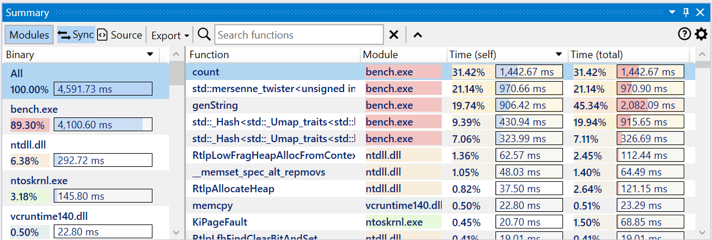
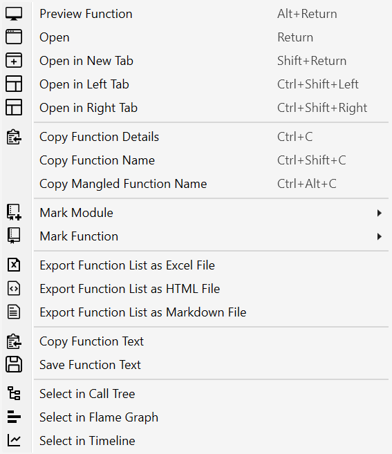

#### Overview

The summary view displays all modules (binaries) and functions that have profile data in the trace, and makes it easy to identify the functions where most time spent. The view has three parts:  

- a toolbar at the top, with action buttons and the *Search* input box.
- the Modules panel on the left side. Its visibility can be toggled using the *Modules* button in the toolbar.
- The list of functions from either the entire trace or filtered to display only the functions part of a single module. By default the list is sorted by self (exclusive) time in descending order.

{:target="_blank"}

##### Modules list

The modules list has an entry for each module with profile data and starts with an *All* entry representing all modules combined. Each entry has the module name, execution time percentage relative to the entire trace and execution time value. Modules are sorted by their execution time in descending order.

By default the *All* entry is active and the function list displays all functions with profile data in the trace.  

*Double-click* a module (or use the Return key) to display only its functions. Selecting a module while the *All* entry is active selects its functions in the list.

##### Functions list

The function list has an entry for each function with profile data. Each entry has the demangled (undecorated) function name, module and self (exclusive) execution time and total (inclusive) execution time. If CPU performance counters are found and loaded from the trace, the additional columns with metrics and the counters are appended after the last column.  

The list is filtered based on the active module. The displayed columns and style can be customized in the Summary options.

The function list is by default sorted by the self (exlusive) execution time in decreasing order.  
*Click* the same column header to toggle between decreasing and  increasing order.  
*Click* on a column to sort the list based on its values.  

!!! note
    The same sorting actions apply to other list views in the application. Not all list views support sorting currently.  
    
    The columns in all list views can be resized and reorder.   The new layout is saved across sessions when closing the application.

If marking of functions based on their name or module is active, the function entries use the marking background color.

#### Summary view interaction
    

???+ abstract "Toolbar"
    | Button | Description |
    | ------ | ------------|
    |  | If enabled, selecting a function also selects it in the other profiling views. |
    |  | If enabled, selecting a function also displays the source in the Source file view, with the source lines annotated with profiling data. |
    | Export | Export the current function list into one of multiple formats (Excel, HTML and Markdown) or copy to clipboard the function list as  a HTML/Markdown table. |
    | Search box | Search for functions with a specific name using a case-insensitive substring search. Searching filters the list down to display only the matching entries. Press the *Escape* key to reset the search or the *X* button next to the input box. |

???+ abstract "Mouse shortcuts"
    | Action | Description |
    | ------ | ------------|
    | Hover | Hovering over a function displays a popup with the stack trace (call path) end with the slowest function's instance. Pin or drag the popup to keep it open. |
    | Click | Selectes the function in the other views if *Sync* is enabled in the toolbar and displays the source in the Source file view if *Source* is enabled in the toolbar.  |
    | Double-click | Opens the Assembly view of the selected function in the current tab. |
    | Shift+Double-click | Opens the Assembly view of the selected function in a new tab. |
    | Right-click | Shows the context menu for the selected functions. |

???+ abstract "Keyboard shortcuts"
    | Keys | Description |
    | ------ | ------------|
    | Return | Opens the Assembly view of the selected function in the current tab. |
    | Shift+Return | Opens the Assembly view of the selected function in a new tab. |
    | Ctrl+Shift+Left | Opens the Assembly view of the selected function in a new tab docked to the left of the active tab. |
    | Ctrl+Shift+Right | Opens the Assembly view of the selected function in a new tab docked to the right of the active tab. |
    | Alt+Return | Opens a preview popup with the assembly of the selected function. Press the *Escape* key to close the popup.  Multiple preview popups can be can be kept open at the same time. |
    | Ctrl+C | Copies to clipboard a HTML and Markdown table with a summary of the selected functions. |
    | Ctrl+Shift+C | Copies to clipboard the function names of the selected functions. |
    | Ctrl+Alt+C | Copies to clipboard the mangled/decorated function names of the selected functions. |

???+ abstract "Right-click context menu"
    [{: style="width:380px"}](img/summary-context-menu_569x661.png){:target="_blank"}  

#### Exporting the function list

The current function list can be exported and saved into multiple formats, with the slowest functions marked using a similar style as in the application:

- Excel worksheet (*.xlsx)
- HTML table (*.html)
- Markdown table (*.md)

#### More documentation in progress
- Context menu
- Marking functions
- Options

??? TODO - fix left/right shortcuts context menu
