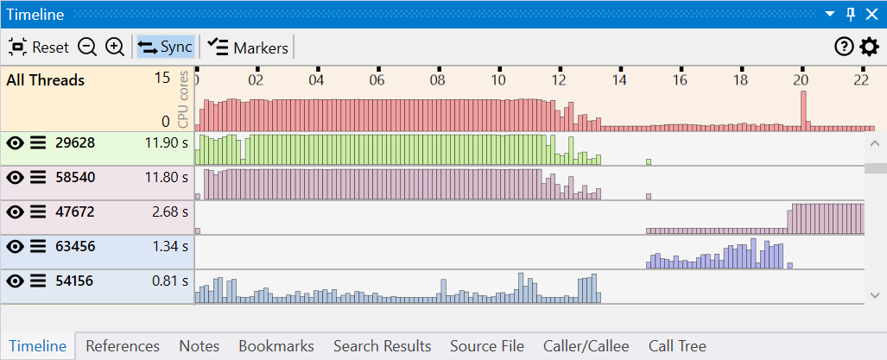

The Timeline view displays the activity of the application for the entire duration of the trace, with each thread having a histogram showing the CPU usage based on the number profile samples collected over time.

This view is helpful to identify the threads and time ranges that had CPU activity (or lack of it due to locks and I/O) and also has features for filtering the entire profile data to consider only specific threads and time ranges.

{:target="_blank"}

The view has three parts:
- a main toolbar at the top, with general action buttons.
- a histogram showing the activity of the entire application, with the activity across all threads combined.
- for each thread, a histogram showing the thread's activity.

Thread names
{:target="_blank"}

Hover

Selecting a time range:  

- all threads  
    {:target="_blank"}
- single thread
    {:target="_blank"}

##### Filtering

- time range
    {:target="_blank"}
- threads
    {:target="_blank"}

- threads context menu
    {:target="_blank"}

Longer hover
{:target="_blank"}

Marking

{:target="_blank"}

- display all and each thread
- threads have ID and optional name, color code by name
- selection with sync selects functions executing in time range and thread (all threads when done on all)
- selection in other panels marks samples 
- right-click on selection context menu to filter by thread and time range. Also with double-click
- left of threads context menu to filter to, include, exclude, etc
- filterng also update top-level menu, shows active filter
- hover shows stack trace of hottest sample at point

TODO later:
- options panel