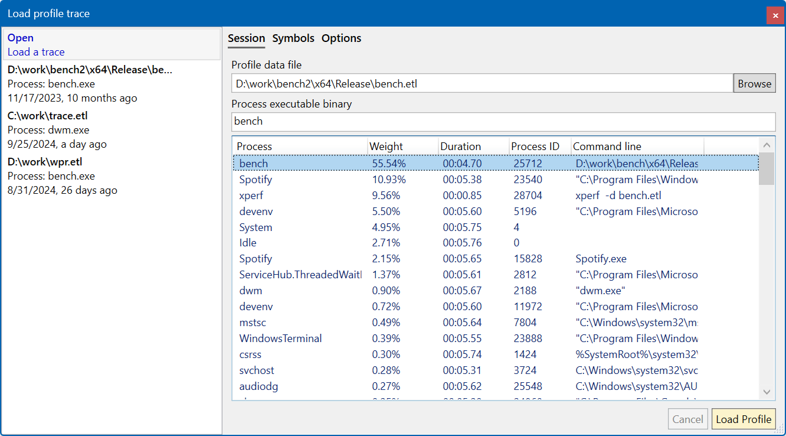
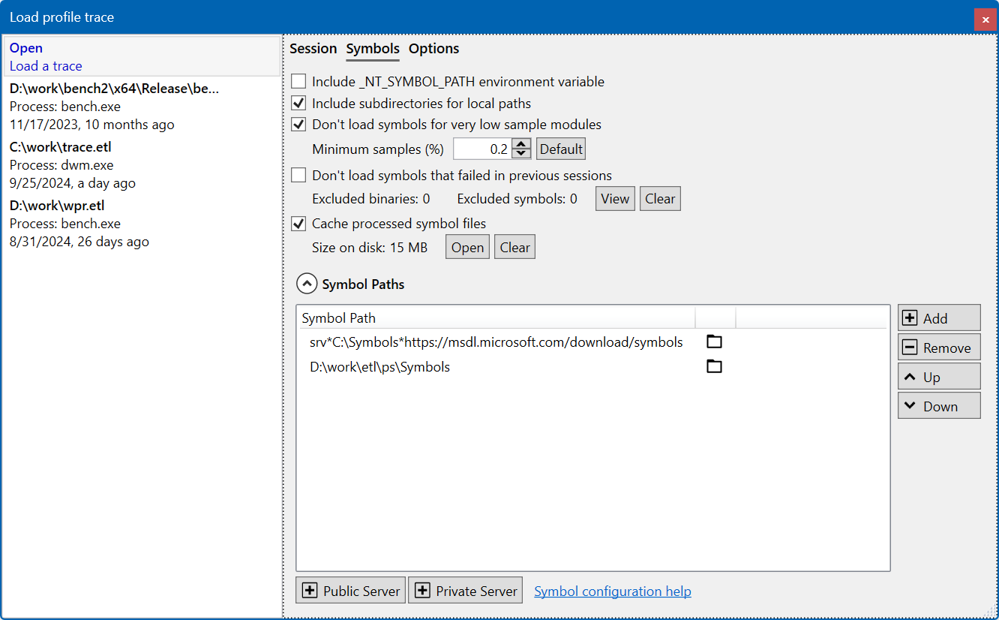
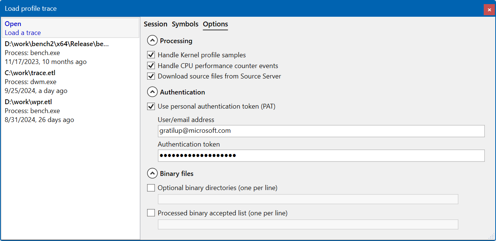

#### Loading a new trace

There are several ways to open a new ETW trace file (*.etl):

- Use the **Open** button in the *Start Page* displayed on startup.
- Use the **Profiling** -> **Load Profile** menu.
- Use the **Ctrl+O** keyboard shortcut.

Once the trace file is selected in the *Open File dialog*, the **Load profile trace** window is displayed. It lists the processes (applications) that are captured in the trace, sorted by weight (number of samples).

{:target="_blank"}

From the list, select the process you want to analyze and press the **Load Profile** button (alternatively, use double-click or the Return key). The selected process is loaded from the trace file, any required binary and symbol files are downloaded and the profiling data is analyzed. Once loading is completed, the window closes and the profiling views are populated, as described in [Profiling UI overview](profiling-ui.md).

#### Loading a previosly opened trace

Previously opened traces are saved as sessions. Recent sessions can be quickly opened again for the same process using either the *Start page* or the session list on the left of the *Load profile trace* window (use double-click or the Return key).

{:target="_blank"}

#### Symbols configuration

Symbols are the binary (EXE/DLL) and debug information (PDB) files required to analyze the processes recorded in a trace. The binaries are used to disassembly individual functions and the debug files are used to resolve function names and provide the source file and line number information.

{:target="_blank"}

##### Symbol paths

Symbols are searched in the locations indicated by the **Symbol Paths** list, found in the **Symbols** tab of the *Load profile trace* window. Symbol locations can be of two types:  

- Paths to local directories or network file shares.  
- Symbol server URLs. By default the [Microsoft public symbol server](https://learn.microsoft.com/en-us/windows-hardware/drivers/debugger/microsoft-public-symbols) is added to the list, with a local download cache directory at *C:\Symbols*.
  
!!! note ""
    More information about symbol servers and the symbol path syntax is available here:  
    [https://learn.microsoft.com/en-us/windows/win32/debug/using-symsrv](https://learn.microsoft.com/en-us/windows/win32/debug/using-symsrv)

##### Additional symbol options

| Option | Description |
| ------ | ------------|
| Include __NT__SYMBOL__PATH environment variable | Append the environment variable's value to the list of searched symbol paths. |
| Include subdirectories for local paths | Consider symbols in sub-directories up to 3 levels deep for the local directories in the *Symbols Paths* list. |
| Don't load symbols for very low sample modules | Skip downloading and loading of symbols for modules with a low number of samples. This helps reduce download time for processes with many modules, where the majority have few relevant samples.   A module is skipped if it has fewer samples than a threshold. This threshold can be configured using the *Minimum samples* field as a percentage of the total number of samples. |
| Don't load symbols that failed in previous sessions | Skip downloading and loading of symbols that could not be found in previous sessions (for example, due to offline symbol servers). The list of skipped symbols can be viewed and cleared. |
| Cache processed symbol files | Cache the processed debug symbol files and use them to speed up loading of traces requiring the same symbols. The cache files are saved in the temporary directory and can be viewed and cleared. |

#### Trace processing options

{:target="_blank"}

| Option | Description |
| ------ | ------------|
| Handle Kernel profile samples | Include samples executing in the kernel context and connect the call stacks between kernel and user mode code. |
| Handle CPU performance counter samples | Process CPU performance counter (PMC) events and display them in the Summary, Assembly and Source File views using additional columns. |
| Download source files from Source Server | Automatically attempt to download source files from the location indicated by the debug info file. If the download URL requires authentication, it can be configured in the Authentication section found below. |

##### Authentication

Authentication using an user/email address and Personal Autehnticaion token (PAT) can be configured for both source file servers and symbol servers.

##### Binary files

Additional local directory paths for searching binary files can be configured. The binary files to process in a trace can be restricted to only the ones in the accepted list.